# Getting Started - Set up your AI Development Environment

As a participant of the hands-on tutorial, you should already be set up with access to the SAP Business Application Studio landscape below which you can use as your development environment.

## Access SAP Business Application Studio (SBAS)

1. Open https://lcapteched.eu10.build.cloud.sap/lobby in a new browser window or tab, which will ask you to login.

2. Open the [Login File for SBAS](https://github.com/vinayhospete/Handson-connect/blob/main/hands-on-user.txt) and pick the login data for your assigned number.

3. Enter the data in the SBAS browser window or tab to complete your login.

    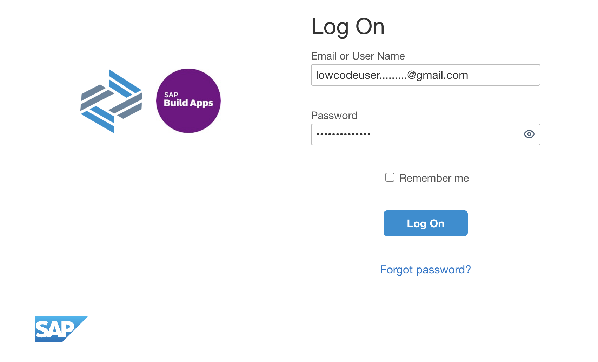

## Access the Dev Space Manager

1. On the SAP Build landing page, click the **Switch Product** button in the top right corner and select **Dev Space Manager**.

    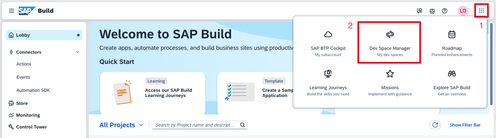

## Open the Development Space

1. Make sure that the development space **AgenticAppDevelopment** has the status running. If stopped, click the **start** button.

    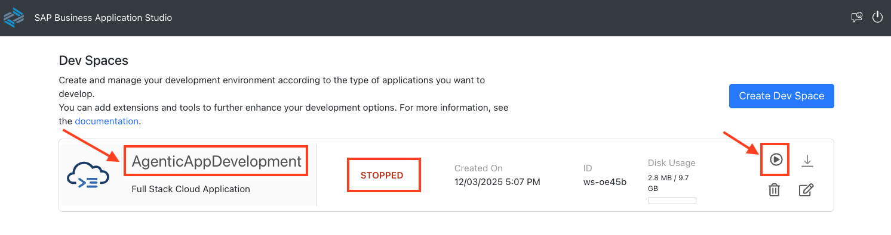


> [!NOTE]
> For this hands-on session, please use only the **AgenticAppDevelopment** development space.

2. Once running, click the development space name to open it. This can take some time.

    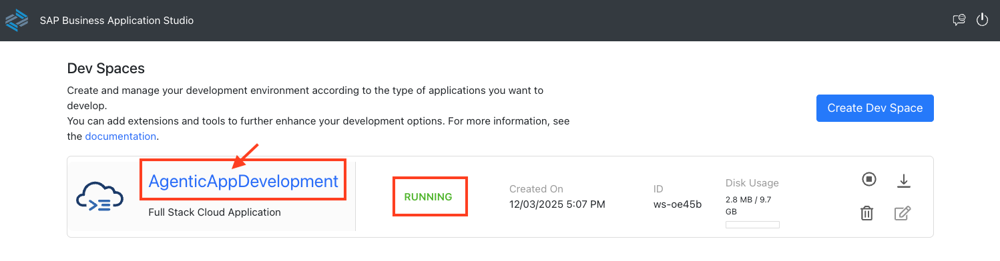

3. Click **OK** in the popup window to accept the tracking settings in the newly created dev space.

    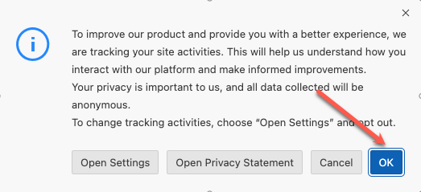

## Install SAP Fiori MCP Server
- Open a new terminal.

    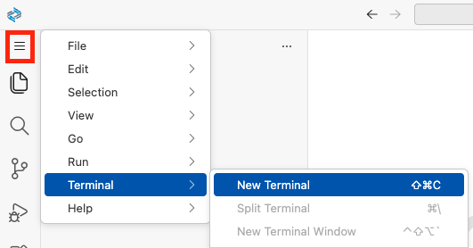

- Execute the following command: 
    ```
    npm i -g @sap-ux/fiori-mcp-server@0.7.2

    ```

    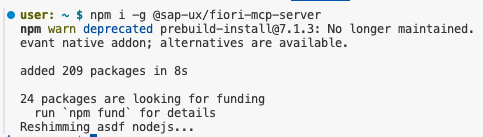

## Verify MCP servers

- Verify that the MCP servers listed below are installed.

    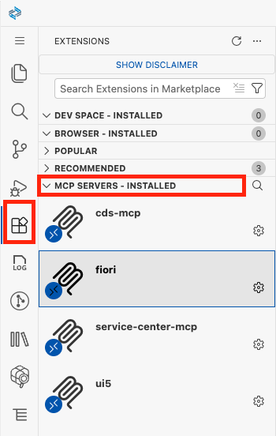
    

## Open your project folder

1. Select the **explorer icon** on the left side.

    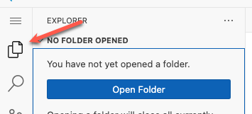

2. Select **Open Folder**.

    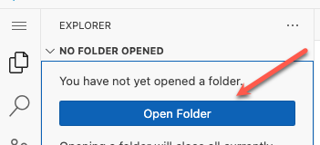

3. Select the **projects** folder from the drop down.

    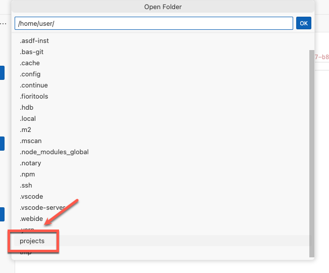

4. Click **OK** and your window will reload.

    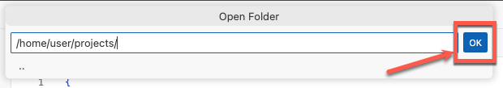

5. Enable **Clipboard access** for the SBAS instance in the Chrome browser.

    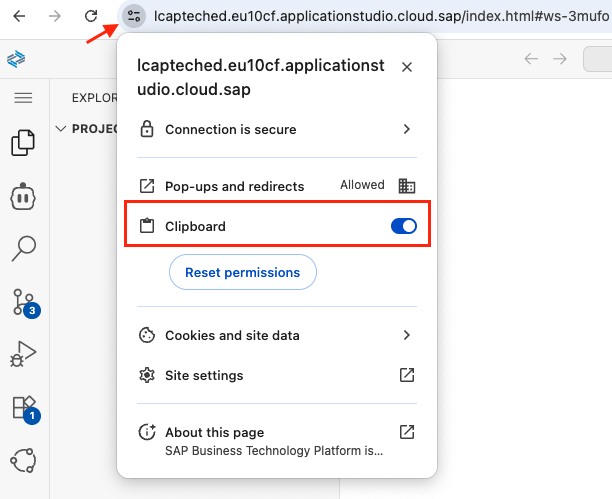

6. Download Image <a href="../../manage-travels-list-report.png" target="_blank" rel="noopener noreferrer">manage-travels-list-report.png</a> to your local disk.

    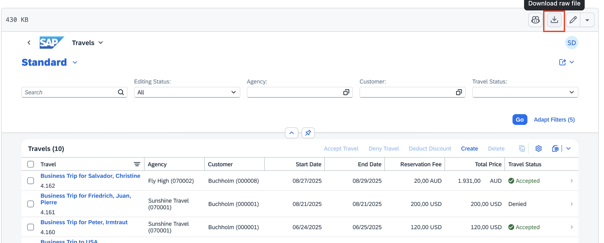

7. Drag and drop the downloaded image to the project explorer.

    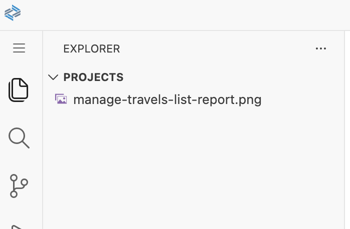

## Configure GitHub Copilot (AI Client)

1. Open **GitHub Copilot**.

    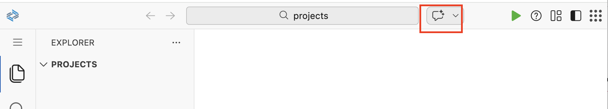

2. Select model **Claude Sonnet 4.5**.

    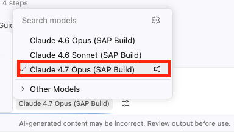


## Summary

You have successfully set up your AI development environment with SAP Business Application Studio and configured GitHub Copilot.

Continue to - [Exercise 1.0 - Create CAP Project and Fiori List Report App based on Image](../ex1.0/README.md)

