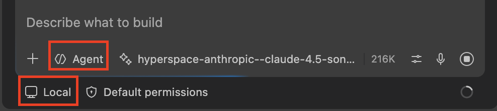
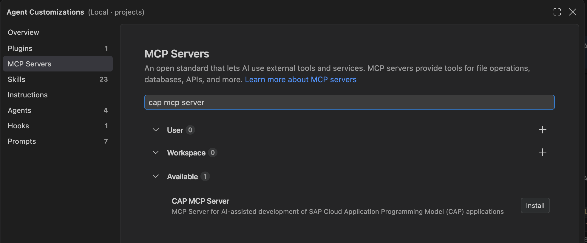
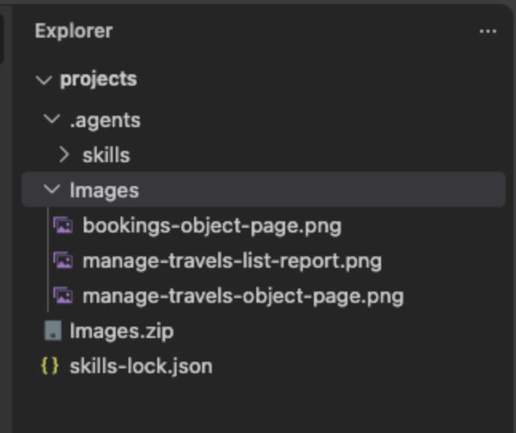

# Getting Started - Set up your AI Development Environment

As a participant of the hands-on tutorial, you will use **Visual Studio Code** on your local machine as your development environment.

## Install Visual Studio Code

1. Download and install Visual Studio Code from the official site: https://code.visualstudio.com/.

2. Launch VS Code once installation is complete.

## Install Prerequisites

Install the following tools so that VS Code can build and run the SAP Fiori / CAP projects used in this tutorial.

### Node.js (LTS)

1. Download and install the latest **LTS** version of Node.js from https://nodejs.org/.

2. Verify the installation from a terminal:

    ```bash
    node --version
    npm --version
    ```

### SAP Fiori tools - Extension Pack

1. In VS Code, open the **Extensions** view (`Ctrl+Shift+X` / `Cmd+Shift+X`).

2. Search for **SAP Fiori tools - Extension Pack** and click **Install**.

    This extension pack bundles the SAP Fiori generators, Application Modeler, Guided Development, XML/annotation tooling, and more.

    > **Note:** The **MCP server for SAP Fiori** is pre-installed and enabled out of the box via the **SAP Fiori tools - Application Modeler** extension (included in this extension pack). No additional installation is required.

3. Reload VS Code if prompted.

## Configure GitHub Copilot (AI Client)

GitHub Copilot Chat is a built-in extension in VS Code and part of standard VS Code installation. You only need to sign in and pick a model.

1. Sign in with your personal or work GitHub account.
2. Open Copilot Chat by opening the Command Palette (`Ctrl+Shift+P` / `Cmd+Shift+P`) and running **Chat: Focus on Chat View**.
3. Click the model dropdown at the bottom of the chat panel.
4. Select any Claude **Sonnet** or **Opus** model version of your choice.
6. Enable the required Copilot settings for this tutorial:

    1. Open the Command Palette and run **Preferences: Open User Settings (JSON)**.
    2. Add the following entries to your `settings.json` at the end (merge them with any existing settings):

        ```json
          "chat.editor.localAgent.enabled": true,
          "chat.defaultToCopilotHarness": false,
          "chat.editor.preferCopilotHarness": false
        ```

    3. Save the file and reload VS Code.
    4. Open Copilot Chat and confirm that **Local** is selected in the agent harness (shown in the chat input area).

    


## Install MCP Server for CAP

1. In VS Code, open the Command Palette (`Ctrl+Shift+P` / `Cmd+Shift+P`) and run **MCP: Browse MCP Servers**.
2. In the MCP servers search box, type **cap mcp server**, then click **Install** to add it to your configuration.

    

## Check that both MCP servers respond

1. Open Copilot Chat in VS Code and ensure you are in **agent** mode.
2. Send the following prompt:

    ```text
    List the tools and their description for fiori and cap mcp server in table format
    ```

3. Verify that the response includes tools from both the **Fiori** and **CAP** MCP servers, presented in a table with their names and descriptions. If either server's tools are missing, revisit the installation steps above.

## Install Skills for CAP and SAP Fiori Application Development

To enhance AI assistance with CAP and SAP Fiori development patterns and best practices, install the corresponding skills:

1. Open the integrated terminal in VS Code.
2. Run the following command to install the skills for CAP development:

    ```bash
    npx skills add https://github.com/capire/skills.git
    ```

    Follow the interactive prompts and choose **Project** as the installation scope.

3. Run the following command to install the SAP Fiori development skills:

    ```bash
    npx -y skills add https://github.com/SAP/open-ux-tools/tree/main/plugins-coding-agents/fiori/skills --skill '*'
    ```

    Follow the interactive prompts and choose **Project** as the installation scope.

## Open your projects folder

In the next exercises you will use AI to **generate a new project** inside this projects folder — it should be empty at this point.

1. Create an empty local folder named `projects` anywhere on your local system (for example `~/user/projects` on macOS/Linux or `C:\user\projects` on Windows).

2. Download the **Images.zip** file and extract it into your `projects` folder:
    - Download [Images.zip](../../Images.zip)
    - Extract the contents into the `projects` folder
    - You should now have an `Images` subfolder containing the exercise images

3. In VS Code, choose **File > Open Folder…** and select the `projects` folder.

    

4. If VS Code asks about trusting the folder, confirm **Yes, I trust the authors**.


## Summary

You have successfully set up your AI development environment with Visual Studio Code, installed the SAP Fiori tools - Extension Pack and Node.js, installed the **sap-ux-fiori-tools** Copilot plugin, and signed in to the built-in GitHub Copilot with a Claude **Sonnet** or **Opus** model of your choice.

Continue to - [Exercise 1.0 - Create CAP Project and Fiori List Report App based on Image](../ex1.0/README.md)

