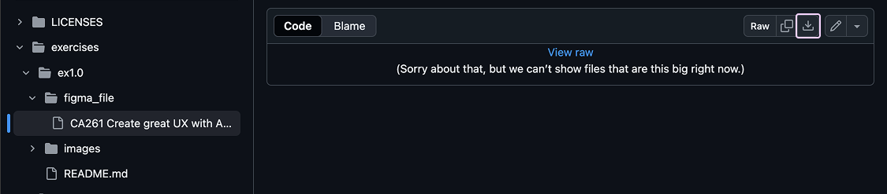
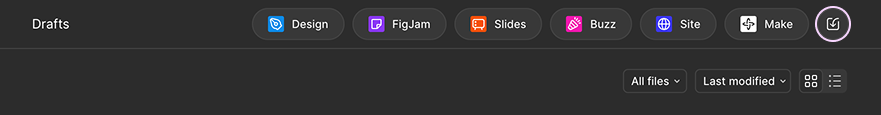
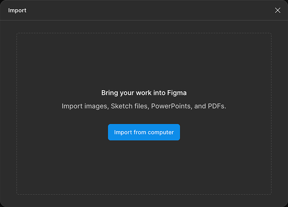
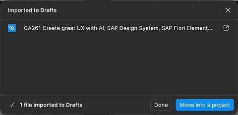
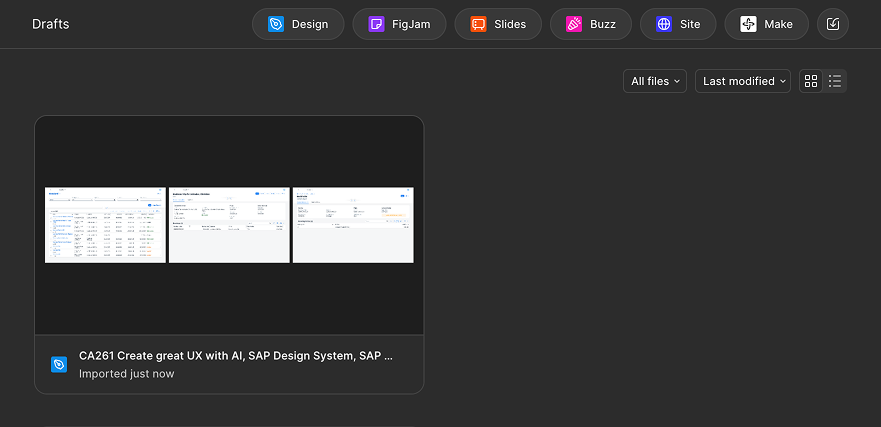
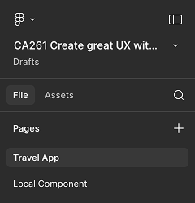
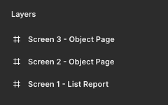
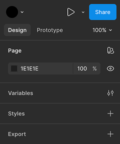

# Open Figma and login to it

1. Open **[Figma](https://www.figma.com/login)** in a browser, which will ask you to login.

2. Open the **[Login File for Figma](../../figmaLogin.txt)** and pick the login data for your assigned number. Enter the data in the Figma browser window to complete your login.

# Execute the following steps to open your design

1. Download the **[Figma Design File](./figma_file/CA261%20Create%20great%20UX%20with%20AI,%20SAP%20Design%20System,%20SAP%20Fiori%20Elements%20and%20SAP%20UI5.fig)** to your local machine.

   

2. Open the file in the Figma web browser window.

   * Click on **Import** in the top right corner.

      

   * In the dialog that appears, click on **Import from computer** and select the downloaded file.

      

   * Once the import is complete, click on **Done**.

      

   * Now, your **Drafts** should contain the imported file. Double-click on it.

      

3. Explore the Figma interface.

   * The design will open in the current browser window.

      

   * In the left side panel, you’ll see the layer structure of the design.

      

   * In the right side panel, you’ll find settings and properties for each selected element in the main design area.

      

Continue to - [Exercise 1.1 - Adjust the buttons in the object page header](../ex1.1/README.md)
