# Create CAP Project and Fiori List Report App based on Image

1. In Copilot, choose **Agent mode**.
    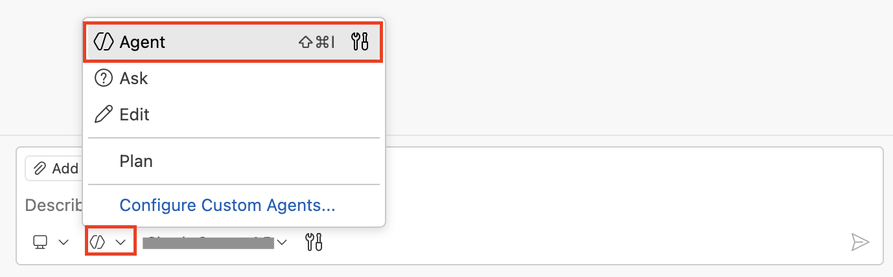

2. Upload [manage-travels-list-report.png](../../manage-travels-list-report.png) to the copilot context and execute the task.

    

    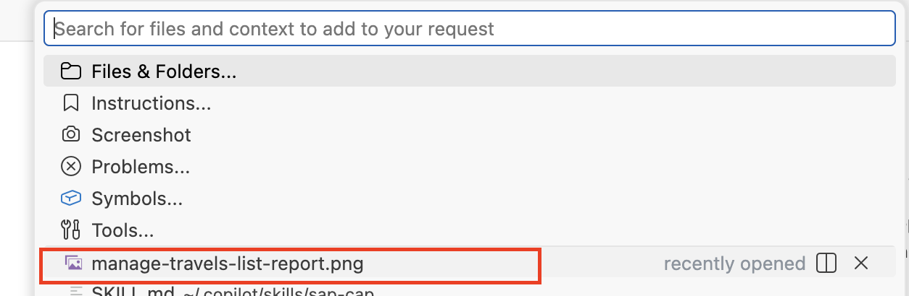

3. Copy and paste the following prompt into the task input and execute the task:

    ```
    Generate a new CAP project and SAP Fiori app based on Image attached to the context.
    Include technical key and business key for all entities.
    Create implementation plan first, then proceed with confirmation.
    Consult available MCP servers.
    ```

    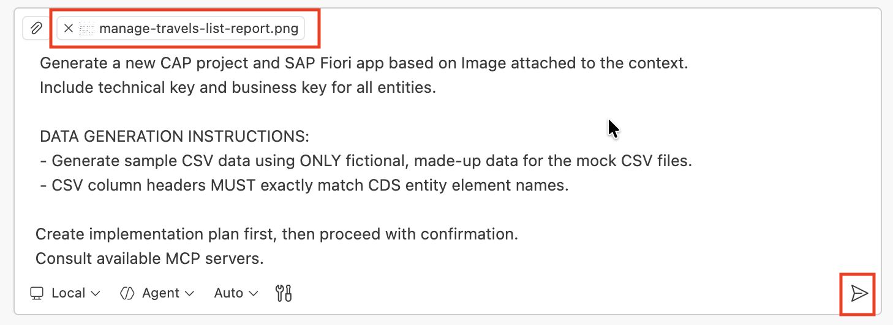

4. Copilot prepares an implementation plan.

    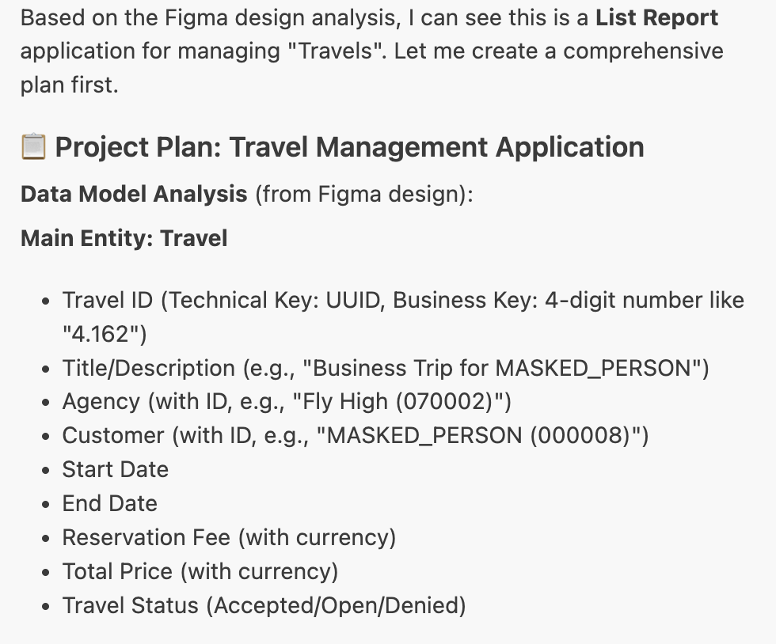

5. When Copilot asks:
- "Shall I proceed with this implementation plan?", confirm by responding with "Yes" or "Proceed".
- Click Allow when prompted to run Bash commands

    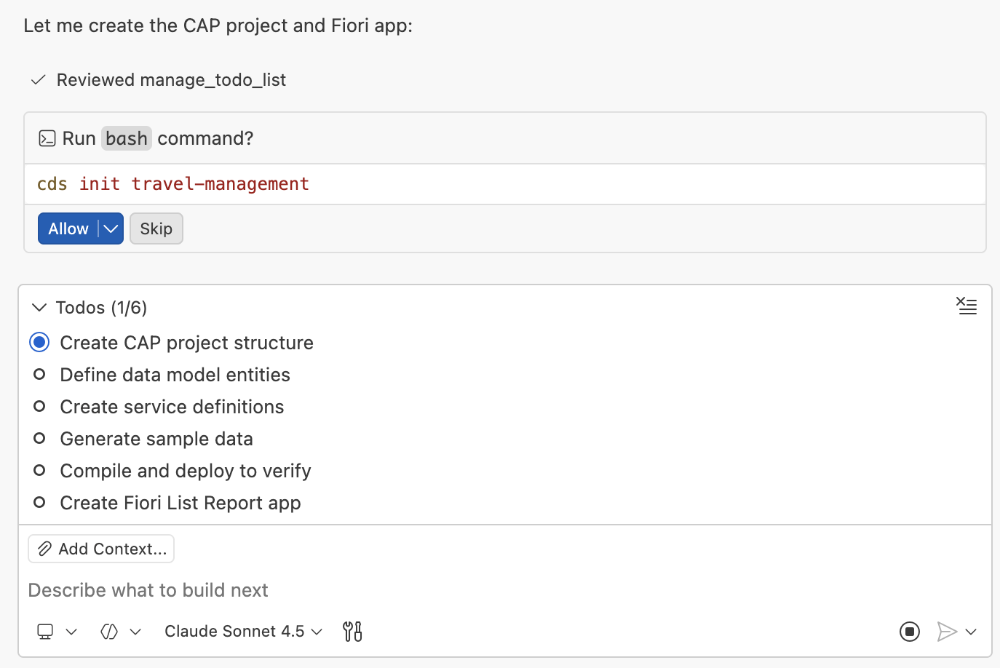

> [!NOTE]
> The implementation plan generated by Copilot may differ from the example shown above. The above image is just for reference.

6. Review the files and content created by Copilot, then click **Keep** to accept them.

    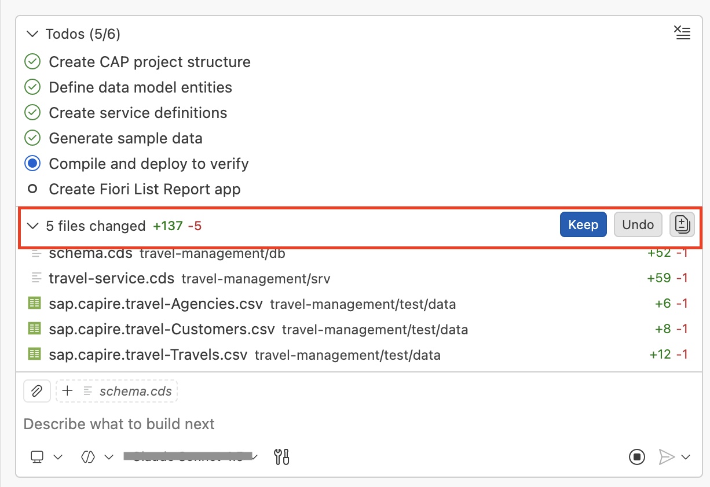


7. After completing all the to-dos/tasks, Copilot confirms the successful creation of the CAP project and Fiori app.

8. Execute the prompt `/sap-fiori preview application`. The application should automatically open in your browser, displaying a travel list report application that matches the list report Image.

    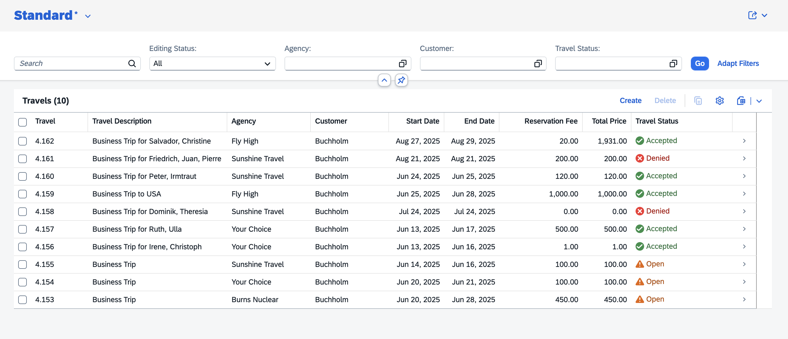

## Troubleshoot

1. Application preview does not open automatically in the browser:

    - You can start the watch script manually:
        - Open the **package.json** file.
        - Right-click on the **watch** script and select **Run Script**.

        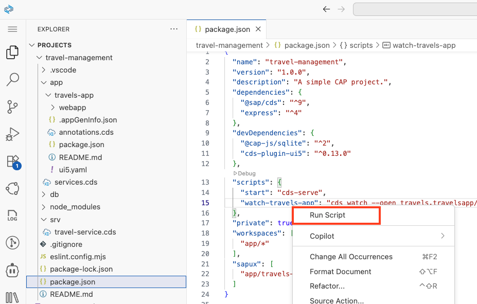

2. `ENOSPC: System limit for number of file watchers reached`

    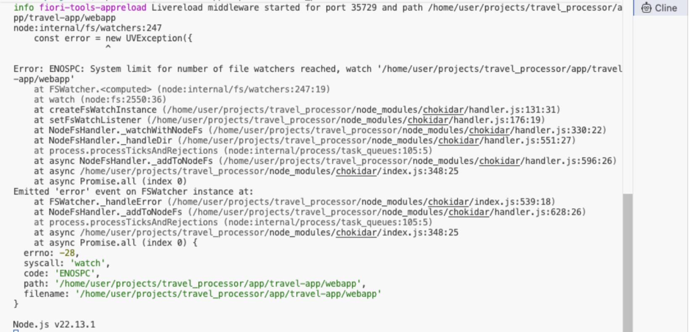

    Add below script to **package.json** file:

    ```
    "cds": {
        "watch": {
            "excludes": [
                "**/node_modules",
                "**/target",
                "db/data.sqlite"
            ]
        }
    }
    ```
    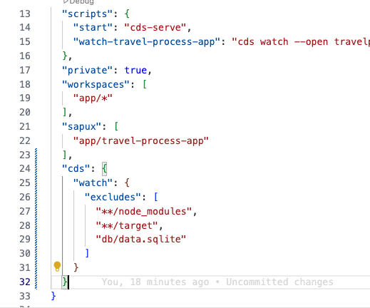

3. If HTTP port 4004 is already in use, press `Enter` to restart preview with a different port number.

> [!NOTE]
> Ensure that you either use 4004 or the system-assigned port for the preview. Check terminal instances and delete any duplicate processes running to preview the application.

4. If the application prompts for authentication, use username: `dummy` and password: `dummy`.

5. In the browser, if your application does not load or displays a blank page:

    - Open Developer Tools in your browser to check the error message by pressing `F12` or `Ctrl` + `Shift` + `I` (Windows/Linux) / `⌘` + `Option` + `I` (macOS).

        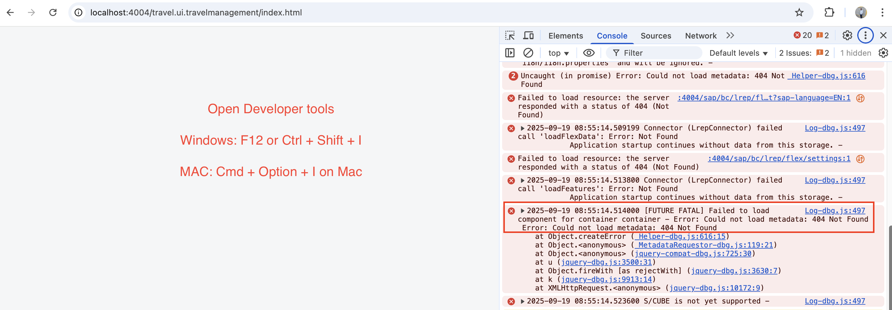

    - For a 404 error, enter the prompt:
        ```
        Error: Could not load metadata: 404 Not Found
        ```
        - Press `Enter` and Copilot will fix the service URL path issue.

    - For a 200 error, enter the prompt:
        ```
        Check if the EDM JSON expression ($edmJson) syntax is incorrect and validate it using CAP MCP.
        ```
    - If the issue still exists, enter this prompt:
        ```
        Remove all instances of EDM JSON ($edmJson) expression syntax from the code.
        ```

## Summary

You have successfully created a CAP project with a Fiori List Report application based on the Image.

Continue to - [Exercise 1.1 - Enable automatic data loading in List Report](../ex1.1/README.md)
