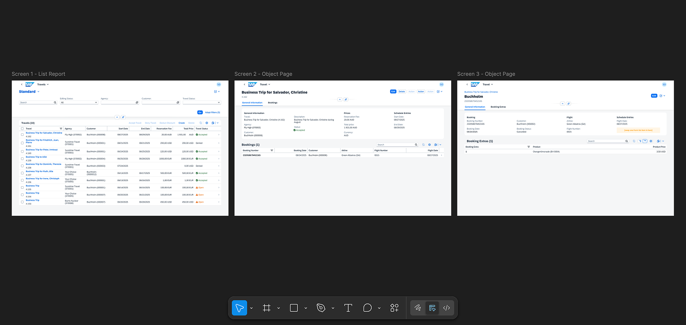
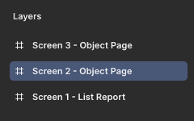
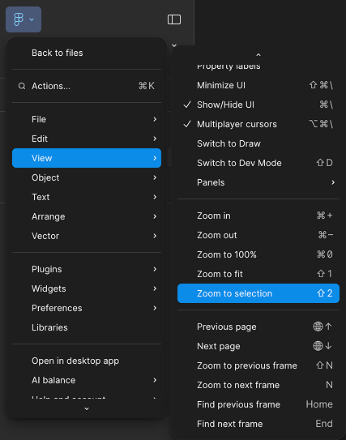
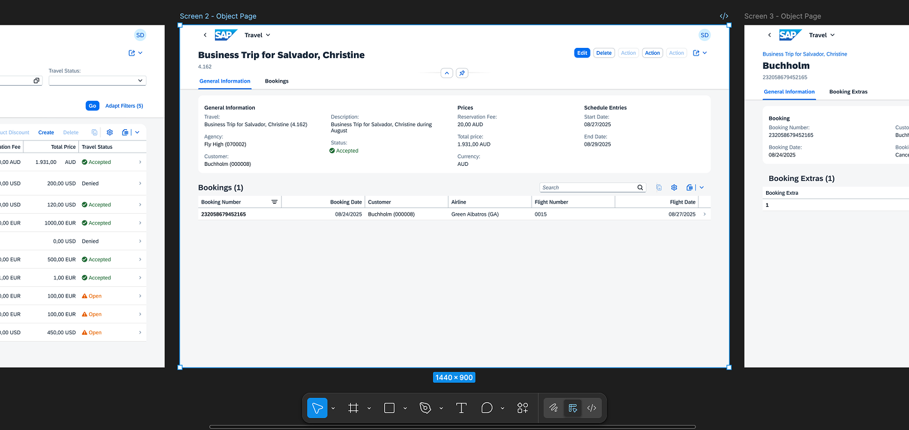
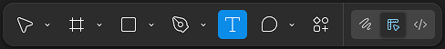
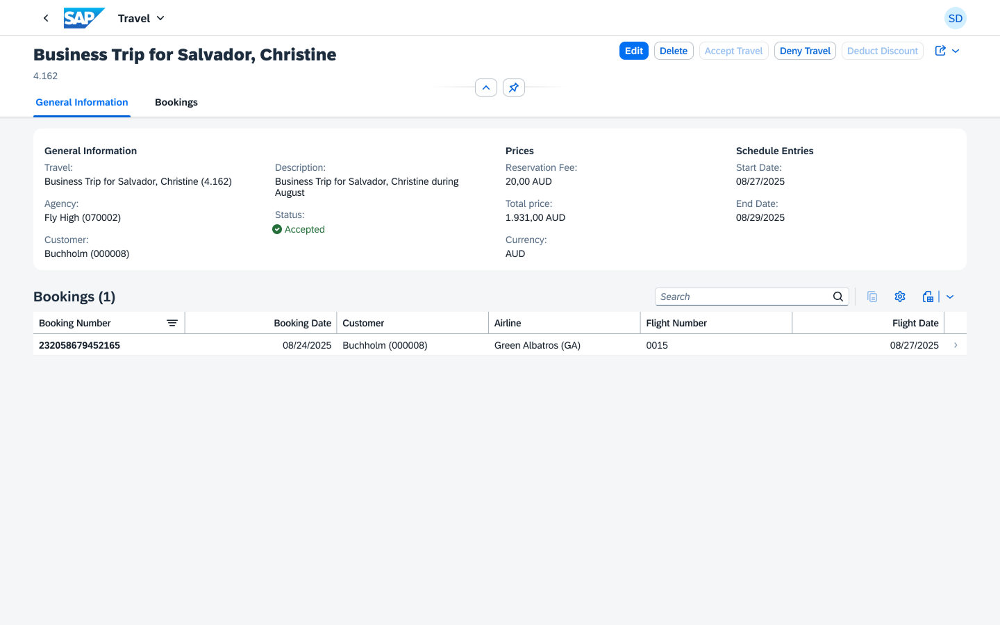

## Adjust the buttons in the object page header

1. **Explore the Canvas**  
* Familiarize yourself with the canvas in the center of your screen. You’ll see three prepared frames—each representing a screen of the application.

    

2. **Navigate to Screen 2**   
* Select the **_Screen 2 - Object Page_** in the left side panel.

    

* Press **_Shift + 2_** on your keyboard to zoom in to the selection, or from the main menu select **_View_** → **_Zoom to Selection_**.

    

* Your canvas is now focused on the second screen of your application.

    

3. **Activate the Text Tool**  
Press **_T_** on your keyboard to switch to the **_Text_** tool, or select the **_Text_** tool icon in the tool menu at the bottom of the screen.

    

4. **Edit Button Texts**  
Click into each button’s text field to modify the action labels.

    

    Replace the current button text **_Action_** with the following:

    * **_Accept Travel_**

    * **_Deny Travel_**

    * **_Deduct Discount_**

    

Congratulations! The action buttons now display the correct labels, and your object page header is updated accordingly.

Continue to - [Exercise 1.2 - Add a form item in the object page](../ex1.2/README.md)
