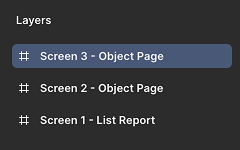
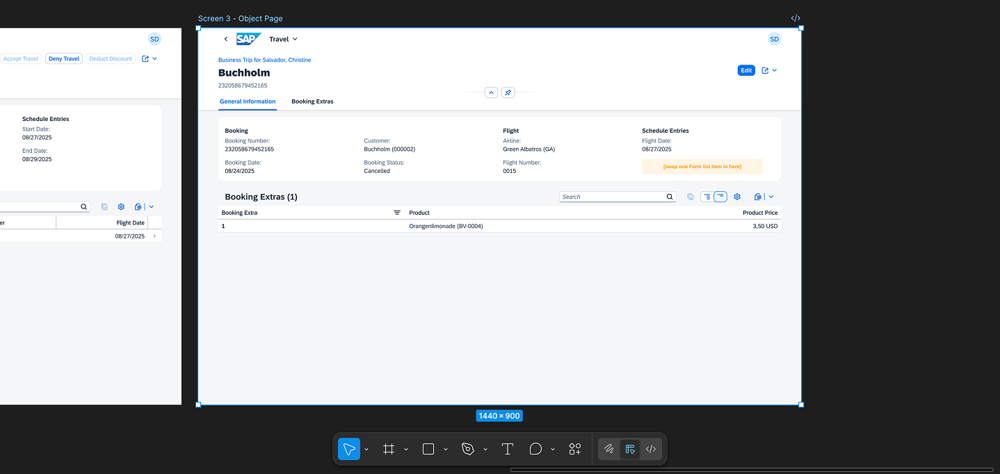
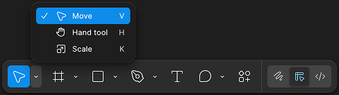
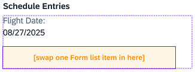
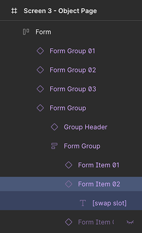
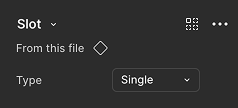
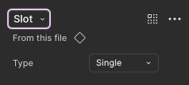
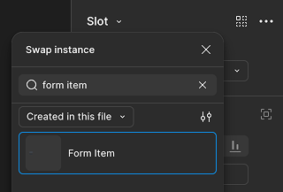

## Add a form item in the object page

1. **Navigate to Screen 3**  
* Select the **_Screen 3 - Object Page_** in the left side panel.

    

* Press **_Shift + 2_** on your keyboard to zoom in to the selection, or from the main menu select **_View_** → **_Zoom to Selection_**.

* Your canvas is now focused on the third screen of your application.

    

2. **Activate the Move Tool**  
* Press **_V_** on your keyboard to switch to the **_Move_** tool, or select the **_Move_** tool icon in the tool menu at the bottom of the screen.

    

3. **Select the Yellow Slot**   
* Find the yellow slot labeled “[swap one Form list item in here]”. Hold **_Ctrl_** and single-click the item to select it.

    

* The left side panel will display the expanded tree structure. Select **_Form Item 02_**.

    

* The right side panel will show the properties of the selected yellow slot.

    

4. **Swap the Component**  
* At the top of the right panel, you'll see the component name **_Slot_**.

    

* Click the dropdown to open the **_Swap Instance_** popup.

* In the search field, type **_form item_**

* In the dropdown, select **_Created in this file_**.

* Review the results and choose the item that matches your search term.

    

* Once selected, the slot will be replaced with the new component. You can see the visual update immediately on the frame.

Continue to - [Exercise 1.3 - Edit the new form item in the object page](../ex1.3/README.md)
