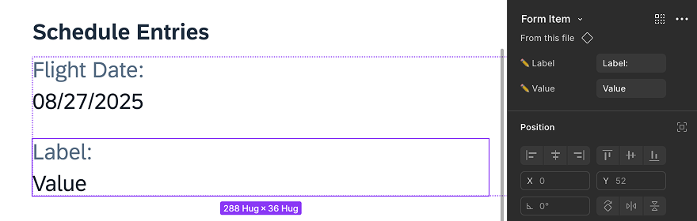
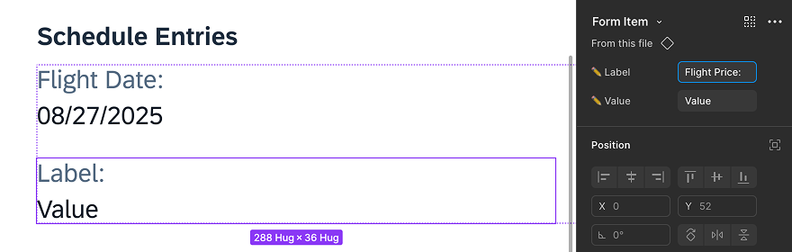
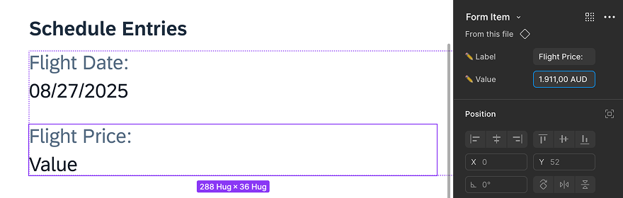
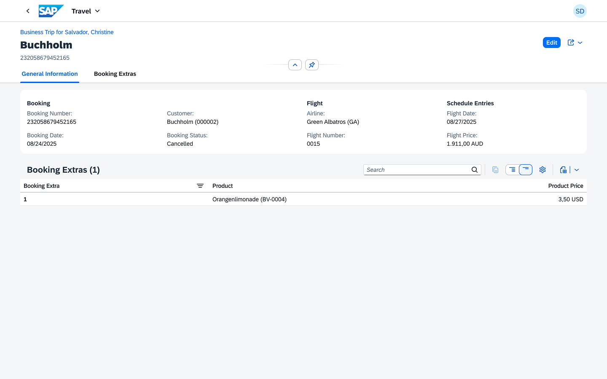

# Edit the new form item in the object page

1. Select the New Component.

    * You’ve just swapped the **Slot** with a **Form Item**. The new component should now be highlighted on the canvas.
    * If it isn’t, hold `Ctrl` (Windows/Linux) / `⌘` (macOS) and **single-click** the component outside the text to select it manually.

2. View Component Properties.

    * At the top of the right side panel, you’ll now see the properties of the **Form Item** component—specifically **Label** and **Value**.

        

3. Edit the Label.

    * Locate the **Label** field, which is marked with an edit icon. Click in the field and type `Flight Price:`.

        

    * Press `Tab` on your keyboard to leave the field and see the result.

4. Edit the Value.

    * Locate the **Value** field, which is also marked with an edit icon. Click in the field and type `1.911,00 AUD`.

        

    * Press `Tab` on your keyboard to leave the field and see the result.

## Summary

You’ve successfully updated the form item with a new label and a new value.

Continue to - [Exercise 1.4 - Create a personal access token](../ex1.4/README.md)
