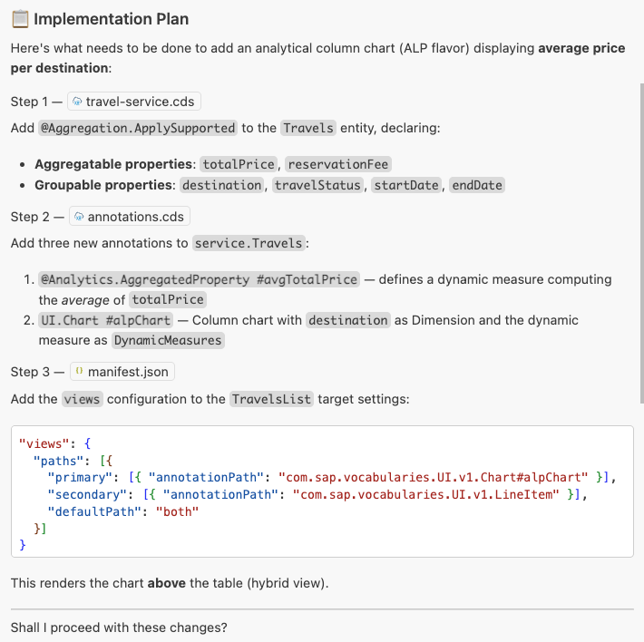
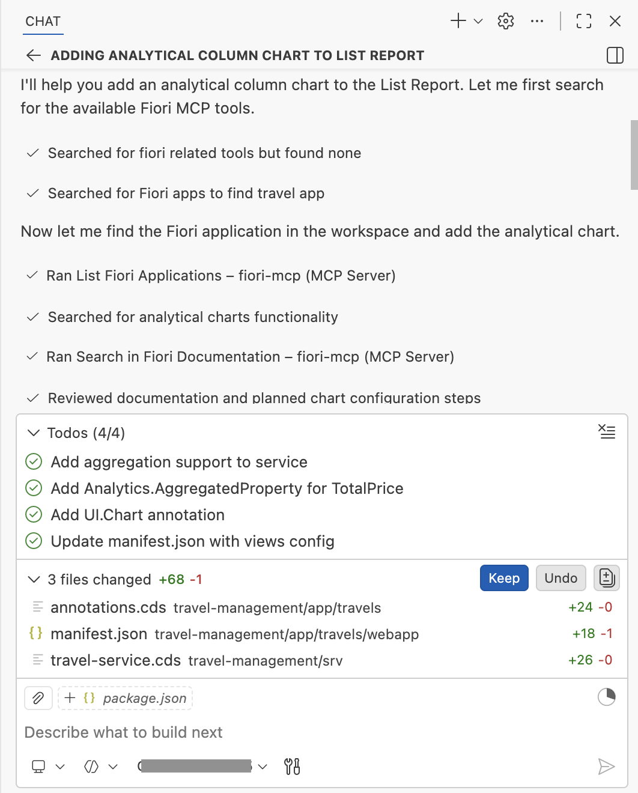
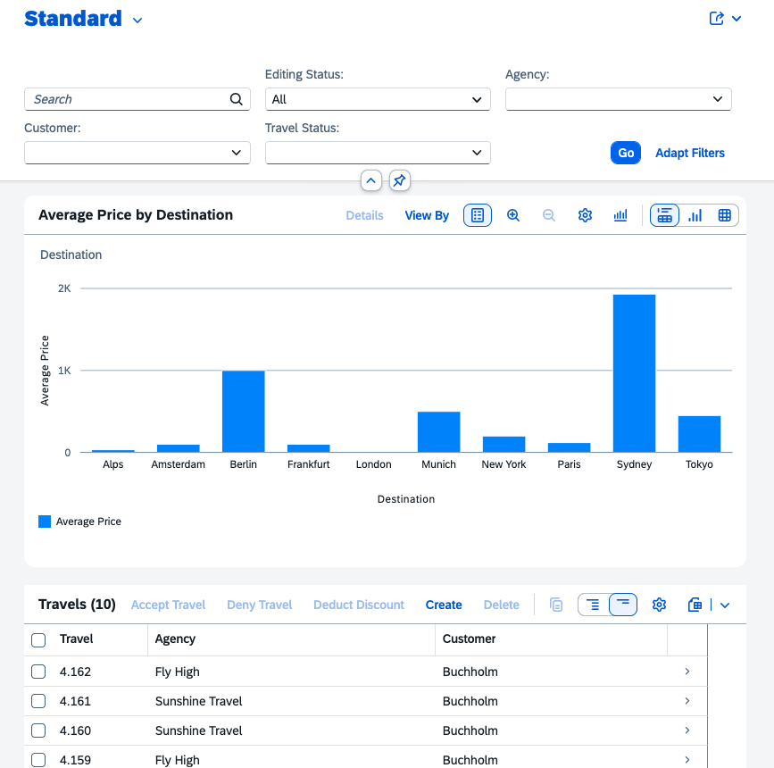

# Add an analytical column chart to the List Report

1. Create a new chat.

    

2. Enter the prompt in the task input:
    ```
    Add an analytical column chart to the List Report (ALP) that displays the average price per destination.
    Configure Price as an aggregated property in the analytical chart,
    and use the Views configuration to display the analytical chart above the table.
    Create implementation plan first, then proceed with confirmation.
    Consult Fiori MCP server.
    ```

3. Execute the prompt. Copilot will consult the Fiori MCP server to access documentation on how to implement analytical charts.

    

4. Confirm the implementation plan by responding with "Yes" or "Proceed".

    

5. After completion, verify that both the analytical chart and table are displayed on the list report page.

    

## Troubleshooting

- If the chart does not appear in the list report, enter the prompt: `Use fiori mcp to verify correct manifest configuration to display chart above table`.

- If you see `[50017] - Invalid data binding`, enter the prompt: `Invalid data binding with chart`.

## Summary

You have successfully added an analytical column chart displaying average price per destination to the List Report page.

Continue to - [Exercise 2.0 - Modify travel object page based on Image](../ex2.0/README.md)
