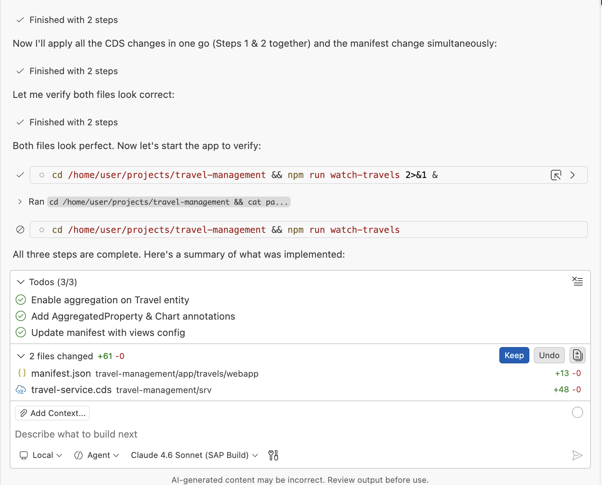
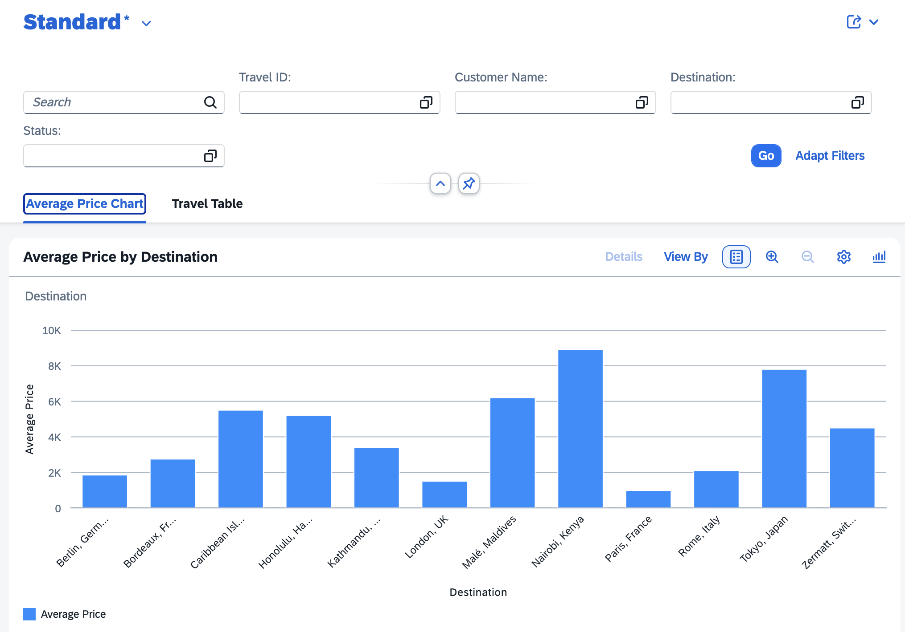

# Add an analytical column chart to the List Report

1. Create a new chat.

    

2. Enter the prompt in the task input:
    ```
   /sap-fiori-analytical-chart Add an analytical column chart to the List Report that displays the average price per destination.
   Create implementation plan first, then proceed with confirmation.
    ```

3. Execute the prompt. Copilot will consult the sap-fiori-analytical-chart skill on how to implement analytical charts.

    

4. Verify that your implementation plan includes the following changes:
    - Add `@Aggregation.ApplySupported` to the Travels entity to enable aggregation on the service
    - Configure `@Analytics.AggregatedProperty` on the price field for the dynamic measure
    - Configure the `UI.Chart` with dynamic measures
    - Update the manifest with views configuration

> [!NOTE]
> If the plan doesn't match, refine your plan by specifying each requirement individually.

5. Confirm the implementation plan by responding with "Yes" or "Proceed" to continue.

    

6. After completion, verify that the analytical chart and table are displayed on the list report page. They may appear in separate views or one below the other.

    

    ----
    OR
    ----
    

## Troubleshooting

- If you see `[50017] - Invalid data binding`, execute the following prompts one at a time:
    1. Add `@Aggregation.ApplySupported` to the Travels entity to enable aggregation on the service
    2. Configure `@Analytics.AggregatedProperty` on the price field for the dynamic measure
    3. Configure the `UI.Chart` with dynamic measures
    4. Update the manifest with views configuration to show both chart and table.

## Summary

You have successfully added an analytical column chart displaying average price per destination to the List Report page.

Continue to - [Exercise 1.4 - Add a visual filter to the List Report](../ex1.4/README.md)
