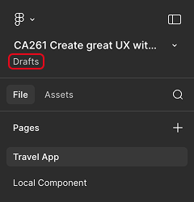
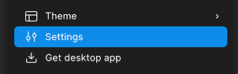
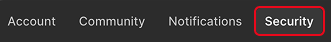
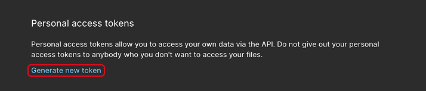
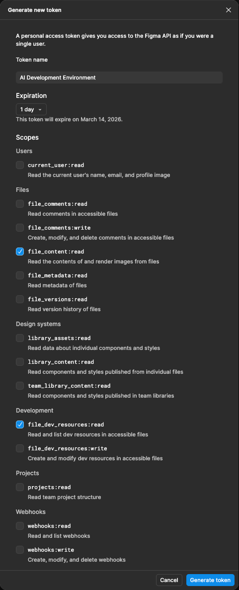

# Create a Figma personal access token

2. In the top left corner of your **design file**, click on **Drafts** to open the **Drafts folder** in a new web browser tab.

    

3. In the top left corner of your **Drafts folder**, click on your Figma user name and select **Settings** from the dropdown.

    

4. Select the **Security** tab.

    

5. In the **Personal access tokens** section, select **Create new token**.

    

6. Fill out the form and submit it.

    * Enter `AI Development Environment` as the **Token name**

    * Check the following **Scopes**:

        * **file_content:read**
        * **file_dev_resources:read**

    * Click on **Generate token**.

        

7. The generated token will be displayed.

8. Leave the Figma web browser window with the personal access token open while you proceed to the next exercise.

Continue to - [Setup your AI Development Environment](../ex1.6/README.md)
