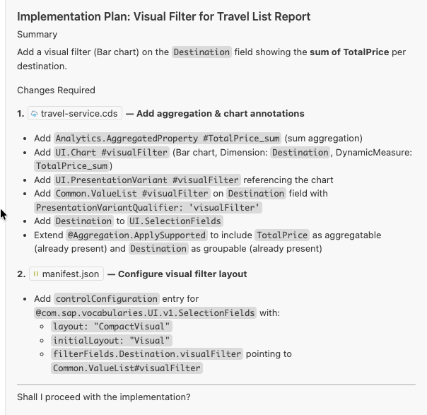
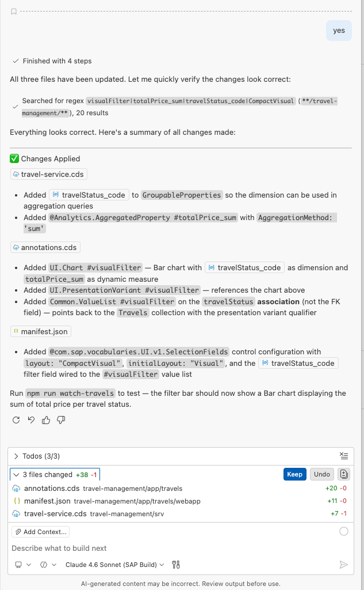
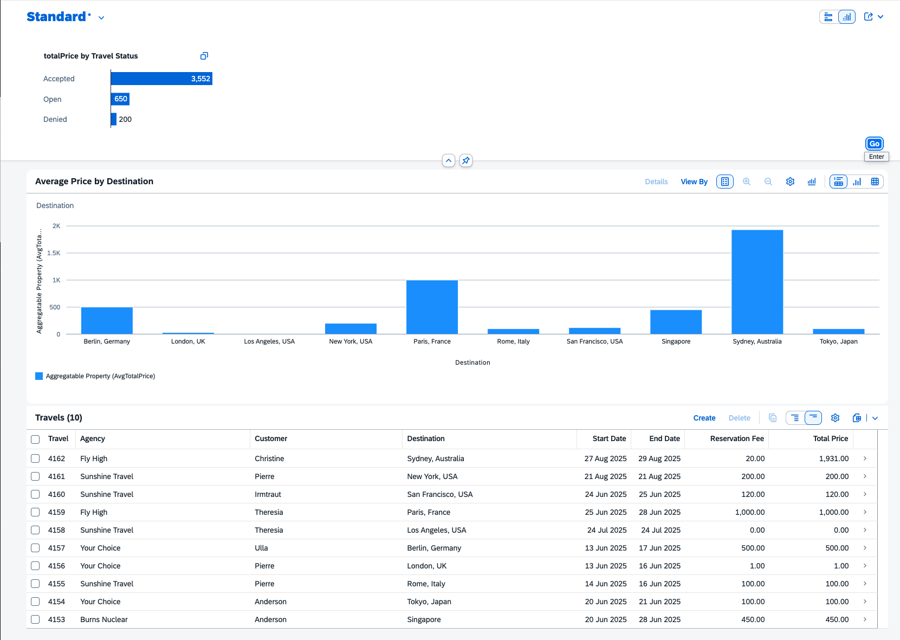

# Add a visual filter to the List Report

1. Create a new chat.

    

2. Enter the prompt in the task input:
    ```
    /sap-fiori-add-visual-filter Add a visual filtar bar to the List Report that displays the sum of total price per traval status.
   Create implementation plan first, then proceed with confirmation.

    ```

3. Execute the prompt. Copilot will consult the sap-fiori-add-visual-filter skill on how to implement visual filters.

    

4. Verify that your implementation plan includes the following changes:
    - Extend `@Aggregation.ApplySupported` on the Travel entity to include `TotalPrice` in AggregatableProperties and `travelStatus_code` in GroupableProperties
    - Add `@Analytics.AggregatedProperty #TotalPrice_sum` for the dynamic measure
    - Add `UI.Chart #visualFilter` with DynamicMeasures
    - Add `UI.PresentationVariant #visualFilter`
    - Add `Common.ValueList #visualFilter` on the Destination field
    - Add `UI.SelectionFields` with Destination
    - Update manifest with `CompactVisual` layout and `filterFields` for Destination

> [!NOTE]
> If the plan doesn't match, refine your plan by specifying each requirement individually.

5. Confirm the implementation plan by responding with "Yes" or "Proceed" to continue.

    

6. After completion, verify that the visual filter bar chart appears above the table on the List Report page and that clicking a destination bar filters the table accordingly.

    

## Troubleshooting

- If the visual filter chart does not appear, execute the following prompts one at a time:
    1. Extend `@Aggregation.ApplySupported` on the Travel entity to include `TotalPrice` in AggregatableProperties and `Destination` in GroupableProperties
    2. Add `@Analytics.AggregatedProperty #TotalPrice_sum` for sum of TotalPrice
    3. Add `UI.Chart #visualFilter` with DynamicMeasures referencing `#TotalPrice_sum`
    4. Add `UI.PresentationVariant #visualFilter` and `Common.ValueList #visualFilter` on Destination
    5. Update manifest `controlConfiguration` with `CompactVisual` layout and `filterFields` for Destination

## Summary

You have successfully added a visual filter bar chart to the Travel List Report, allowing filtering by Destination based on total TotalPrice.

Continue to - [Exercise 2.0 - Modify travel object page based on Image](../ex2.0/README.md)
