# Getting Started - Setting up your AI Development Environment

As a participant of the hands-on, you should already be setup with access to the SAP Business Application Studio landscape below which you can use as your development environment.

## Accessing SAP Business Application Studio (SBAS)

1. Open https://lcapteched.eu10.build.cloud.sap/lobby in a new browser window or tab.

2. Open the [Login File for SBAS](../../SBASLogin.txt) and pick the login data for your assigned number.

3. Enter SBAS login credentials provided to you during the hands-on.

    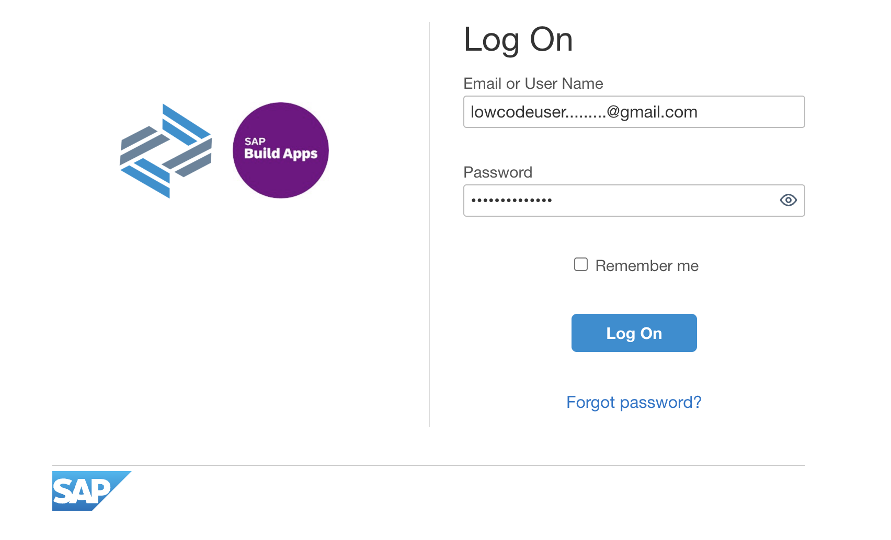

## Accessing the Dev Space Manager

1. On the SAP Build landing page, click button **Switch Product** in the top right corner and select **Dev Space Manager**.

    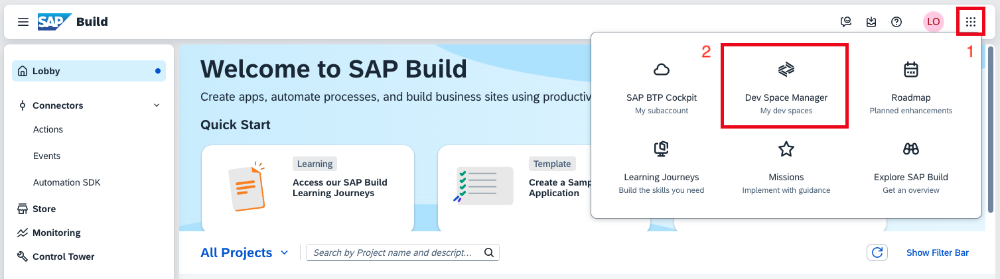

## Opening the Development Space

1. Make sure development space **AgenticAppDevelopment** has status running. If stopped, click the start button.

    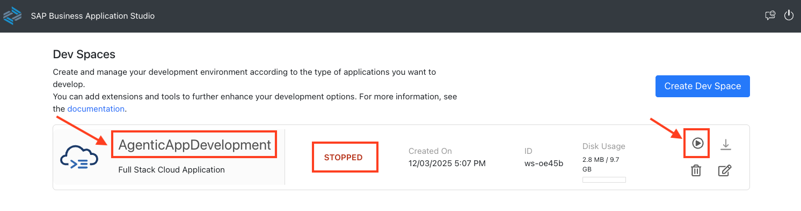

    > [!Note]
    > For this hands-on session, please use only the **AgenticAppDevelopment** development space.

2. Once running, click on the development space name to open it. This can take some time.

    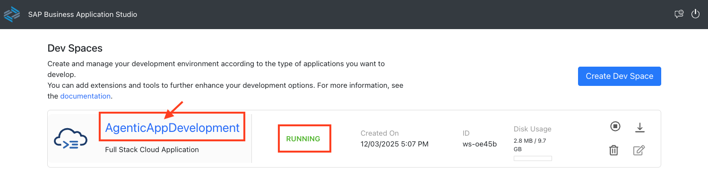

3. Click **OK** in the popup window to accept the tracking settings in the newly created dev space.

    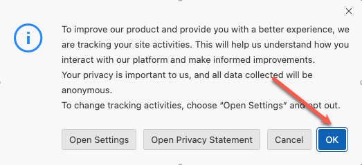

## Open your project folder

1. Open the explorer icon from the left hand side:

    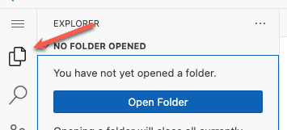

2. Select **Open Folder** button.

    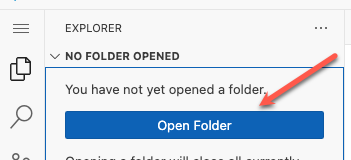

3. Select the **Projects** folder from the drop down.

    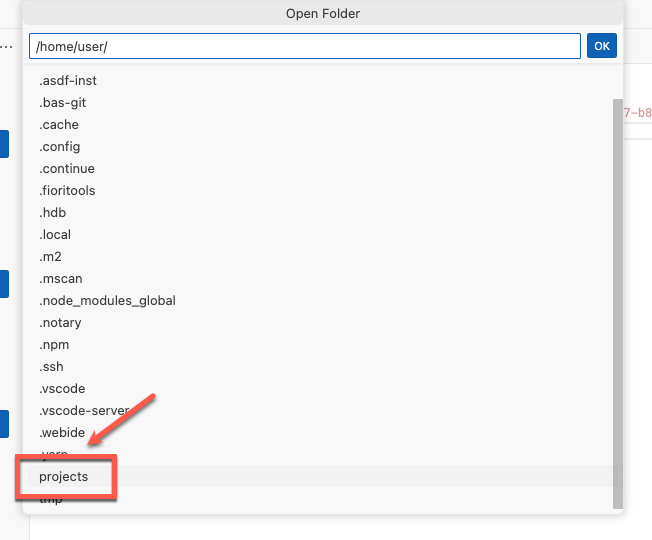

4. Click **OK** and your window will reload.

    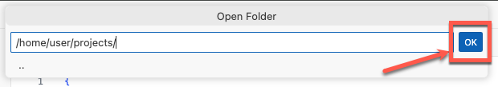

5. Enable Clipboard access to SBAS instance for chrome browser.

    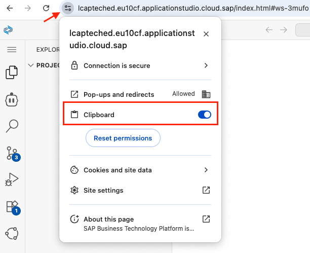

## Configure Cline (AI Client)

1. Open Cline.

    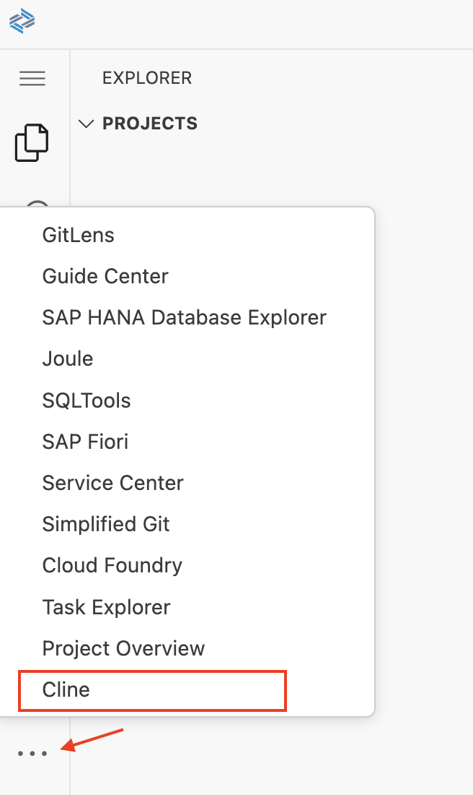

2. Choose `Bring my own API Key`.

    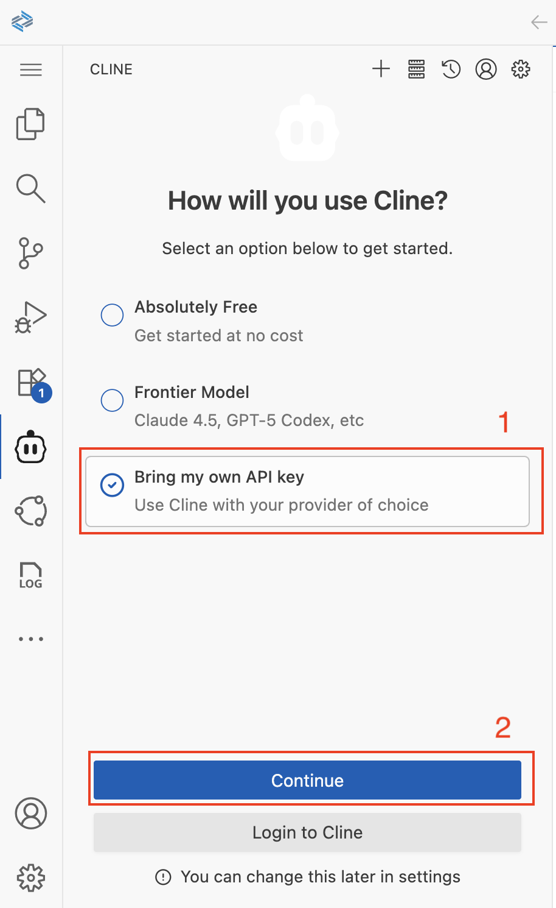

3. Select API Provider `SAP AI Core`, select model `anthropic--claude-sonnet-4`.

    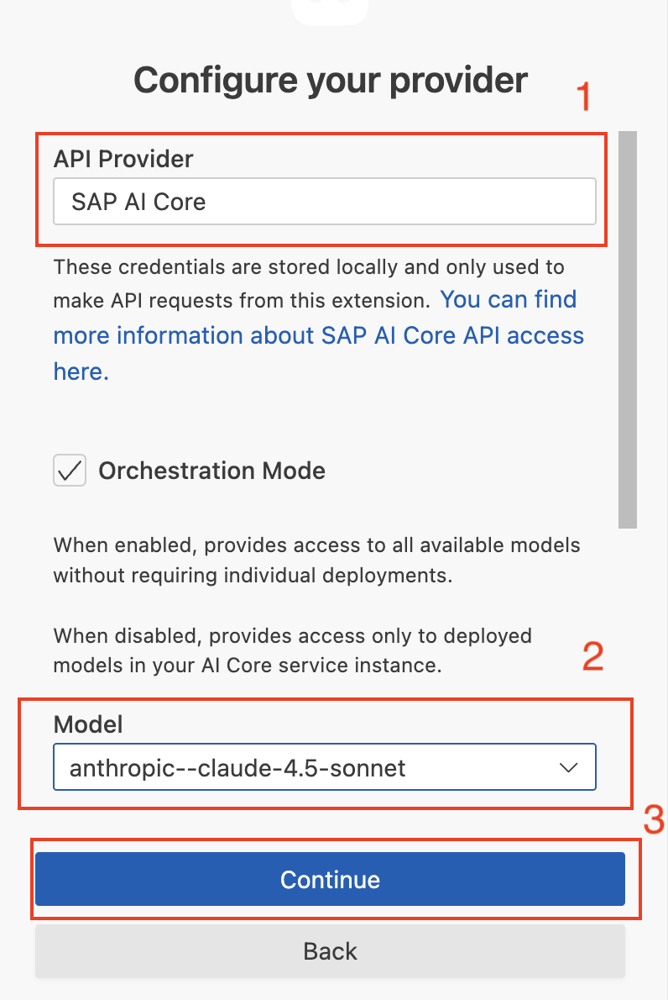

4. Cline is now ready to go.

5. Close all Cline notifications.

    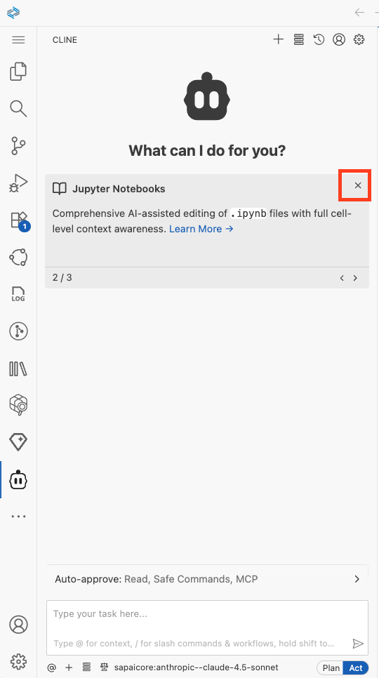

6. Disable Browser Tool Usage:

    - In the **Cline Settings**, click on the **Browser** section.
    - Verify the option **Disable browser tool usage** is selected.

    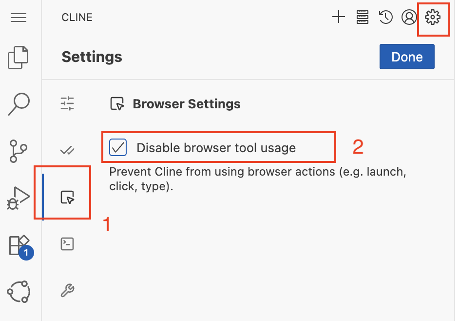

## Finalize Configuration of MCP Servers

1. In the Cline panel, click the **MCP Servers** icon in the top-right corner:
    - Click on **Configure**.
    - Check that `fiori-mcp`, `cds-mcp` and `Framelink_Figma_MCP` are listed.

    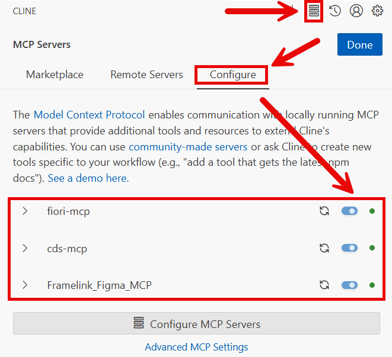

2. Click on **Configure MCP Servers** to open the configuration file.

3. Copy the auth token you have created in the previous excersice to the marked position.

    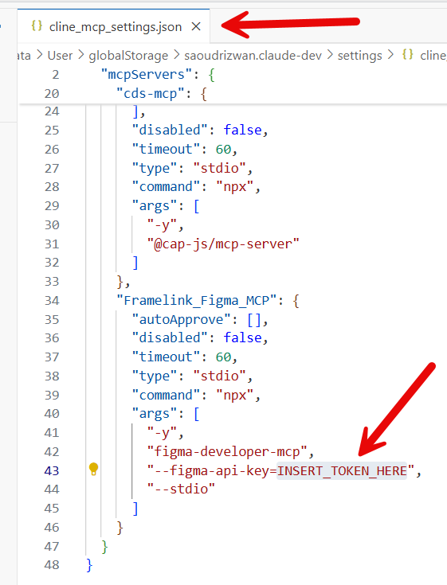

5. Wait until the three MCP servers status' show "green" again. You can use the refresh icon, or restart button if shown to restart each server, in case of problems.

6. Click on **Done** to complete this step

## Enable Auto-Approve settings for Cline

1. Enable auto-approval for file modifications from Cline.

    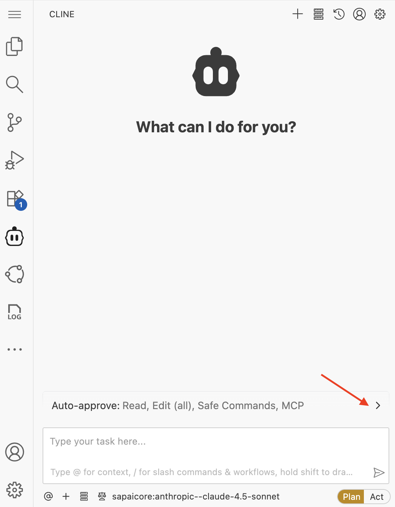

2. Enable auto-approval for MCP server usage.

    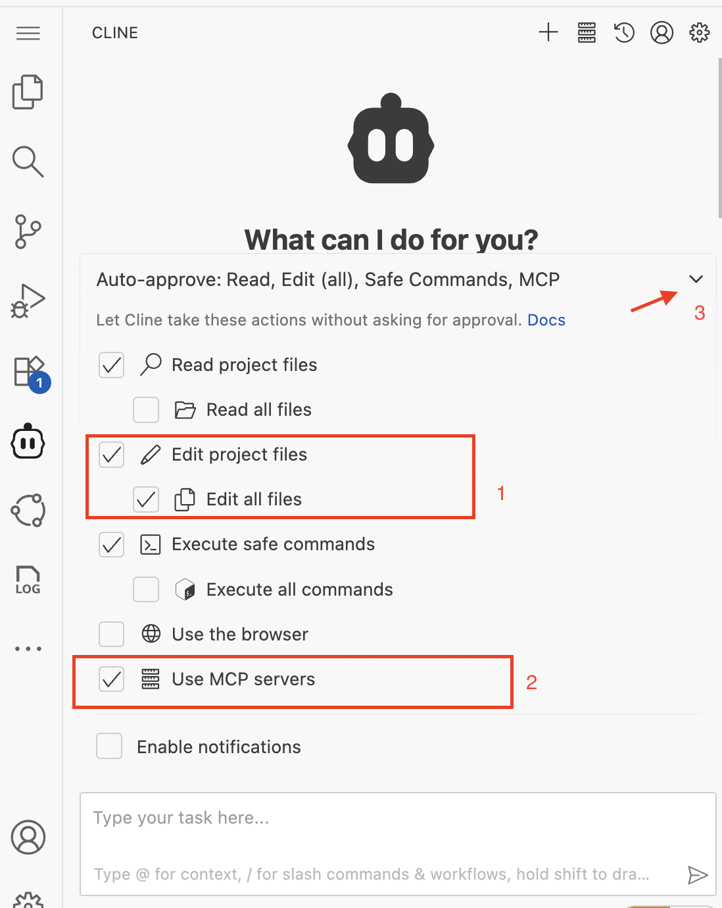

## Summary

You have successfully set up your AI development environment with SAP Business Application Studio and configured Cline.

Continue to - [Exercise 2.0 - Create CAP Project and Fiori List Report App based on Figma design](../ex2.0/README.md)

