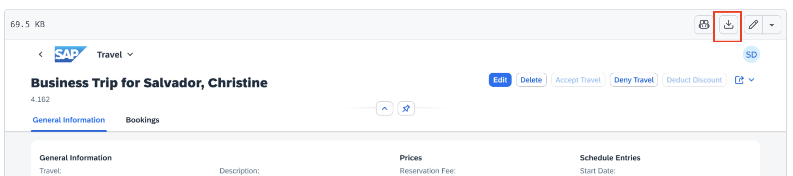

# Modify travel object page based on Image

1. Create a new chat.

    

2. Download the [manage-travels-object-page.png](../../manage-travels-object-page.png) image to your local disk.

    

3. Upload the image to the Copilot context.

    

4. Enter the following prompt in the task input:
    ```
    Modify the travel object page based on Image attached to the context.

    - Reorganize the General Information section into subsections following the Image
    - Align all fields, sections, and structure precisely with the Image
    - Add a bookings table section below displaying flight booking details.
    - Generate mock data for the bookings table.
    Create implementation plan first, then proceed with confirmation.
    Consult MCP servers.
    ```

5. Execute the task.

    

6. Confirm the implementation plan by responding with "Yes" or "Proceed".

    

7. After completion, verify the object page in the application preview:
    - Verify the object page header contains both title and description.
    - Make sure the fields in the **General Information** section are arranged as per the Image uploaded to the context.

    

## Troubleshoot

- The booking table does not appear below General Information section.
    Execute the prompt: `Bookings section should appear below General information section`.

## Summary

You have successfully modified the travel object page based on the Image, including the bookings table section.

Continue to - [Exercise 2.1 - Add Custom Section with RichTextEditor Building Block](../ex2.1/README.md)
