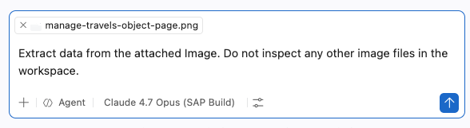
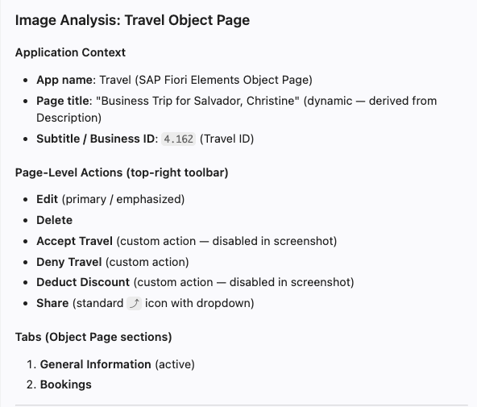
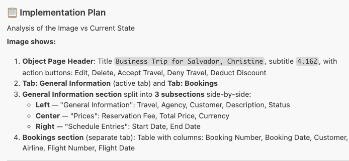
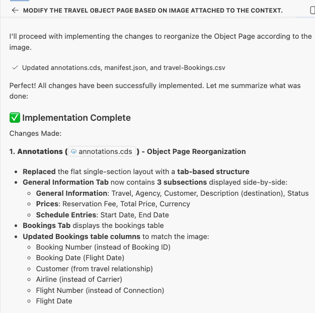
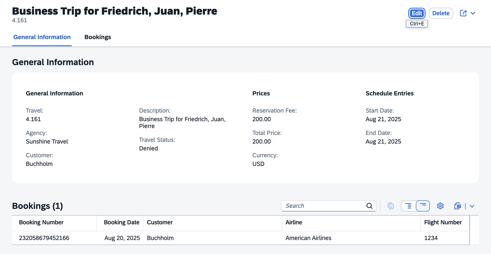

# Modify travel object page based on Image

1. Create a new chat.

    

2. Drag and drop the image [manage-travels-object-page.png](../../manage-travels-object-page.png) from the images folder into the Copilot Chat window to attach it as context.

3. Copy and paste the following prompt into the task input and execute the task:
    ```
    Extract data from the attached Image. Do not inspect any other image files in the workspace.
    ```
    

4. Verify that the extracted data matches the image.

    

5. Copy and paste the following prompt into the task input and execute the task:
    ```
    Modify the travel object page based on the extracted data:

    - Reorganize the General Information section into subsections as shown in the image.
    - Align all fields, sections, and structure precisely with the image.
    - Add a bookings table section below, displaying flight booking details.
    - Generate mock data for the bookings table.

    Create an implementation plan first, then proceed after confirmation.
    
    ```

6. Copilot prepares an implementation plan.

    

7. Confirm the implementation plan by responding with "Yes" or "Proceed".

    

8. After completion, verify the object page in the application preview:
    - Verify the object page header contains both title and description.
    - Make sure the fields in the **General Information** section are arranged as per the Image uploaded to the context.

    

## Troubleshoot

- The booking table does not appear below General Information section.
    Execute the prompt: `Change section layout to page for travel object page`.

- If the object page title is not visible, execute the prompt: `Object page title not visible`

    

## Summary

You have successfully modified the travel object page based on the Image, including the bookings table section.

Continue to - [Exercise 2.1 - Add Custom Section with RichTextEditor Building Block](../ex2.1/README.md)
