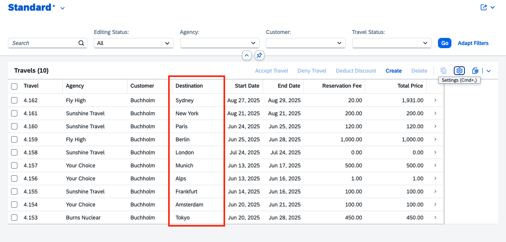

# Add destination column to List Report table

1. Close the previous task.

    

2. Select **Plan Mode**.

    

3. Copy and paste the following prompt into the task input:
    ```
    Create and add a new column "Destination" to the list report table
    ```

4. Press `Enter` to begin. Cline will generate an **Implementation Plan**.

5. Review the plan when ready.

    > [!Note] Cline may ask additional questions or give options to choose from, so here some hints
    > -  You want the LLM to create a new field in the database and schema
    > -  The sample data needs to be updated
    > -  If asked the columns shall be placed next to the agency column in the list report 

7. Switch to **Act mode**.

8. Cline will execute the implementation plan.

9. After completion, confirm the destination column appears in the list report.

    

## Summary

You have successfully added a destination column to the List Report table.

Continue to - [Exercise 2.3 - Add Analytical Chart to List Report Page](../ex2.3/README.md)
