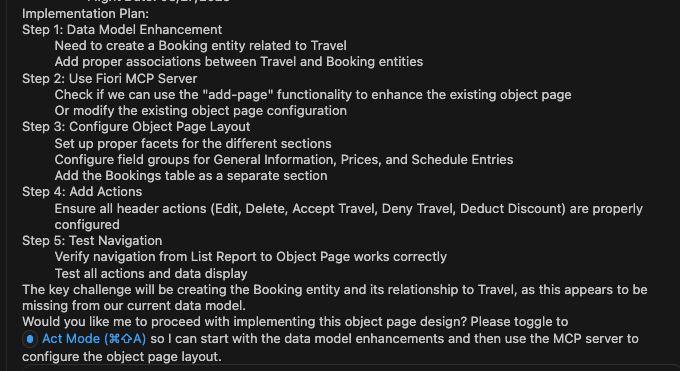
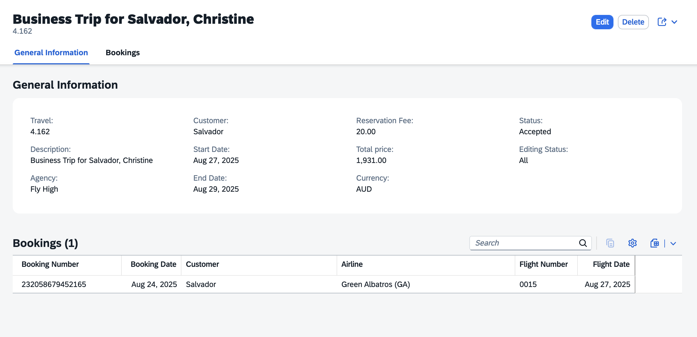

# Modify travel object page based on Image

1. Close previous task.

    

2. Select **Plan Mode**.

    

3. Enter the following prompt in the task input:
    ```
    Modify the travels object page based on figma design
    The object page should include a bookings table section.
    Add mock data for the bookings table.

    <Copy and Paste Figma screenshot(png) for Screen 2 - Object Page here>
    ```

4. Press `Enter` to start the task.

5. Cline will generate an **Implementation Plan**.

6. Review the plan once it's ready.

    > [!Note]
    > The implementation plan generated by Cline may differ from the example shown below.

    

7. Switch to **Act mode**.

8. Cline will execute the implementation plan.

9. After completion, verify the object page in the application preview:
    - Verify object page header contains both title and description.
    - Make sure fields in the **General Information** are arranged as per image.

    

## Troubleshoot

1. Update the Object Page Title and Description based on the image. Use the following prompt:
    ```
    Set the travel description as the object page title and display the travel title below it.
    ```

2. Some fields in the **General Information** section are missing. Use the following prompt:
    ```
    Arrange or add fields in the General Information section as shown in the image @/travel-object-page.png.
    ```

## Summary

You have successfully modified the travel object page based on the Figma design, including the bookings table section.

Continue to - [Exercise 3.1 - Add Custom Section with RichTextEditor Building Block](../ex3.1/README.md)
