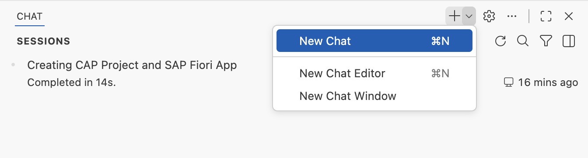
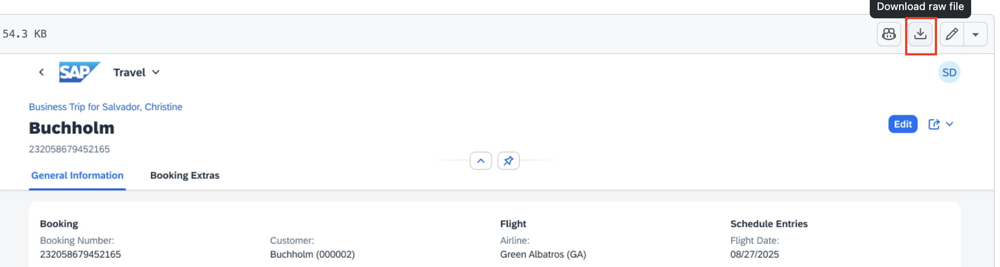
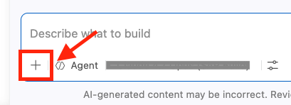
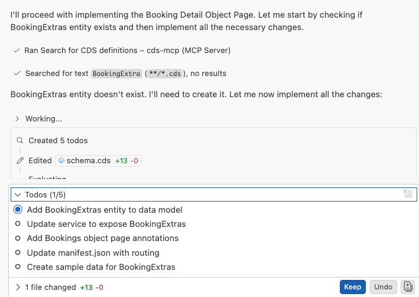
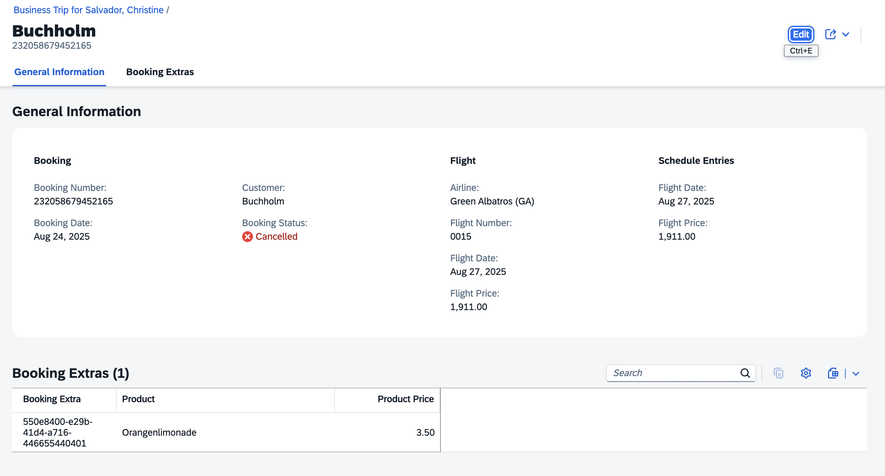

# Add Object Page for Booking Details

1. Create a new chat.

    

2. Download [bookings-object-page.png](../../bookings-object-page.png) image to your local disk.

    

3. Upload Image to the copilot context.

    

4. Enter the following prompt in the task input:
    ```
    Create a booking detail object page based on the Image attached to the context.

    Create implementation plan first, then proceed with confirmation.
    Consult MCP servers.
    ```

5. Execute the task.
    

6. After completion, check the booking object page in the application preview.

    

## Troubleshoot

- The booking table doesn't have navigation. Remind the LLM to add the new page to the app.
- Error `Composition in draft-enabled entity can't lead to another entity with "@odata.draft.enabled" (in entity:"TravelService.Travel"/element:"Bookings")`. Copy and paste the above error message, and Copilot will fix the issue.
- Section **Booking Extras** is missing in the booking object page. Execute the prompt: `booking extras table section is missing`.
- The Booking Extras table has no data. Execute the prompt: `add mock data for booking extras`.

## Summary

Congratulations, you have completed all exercises!
