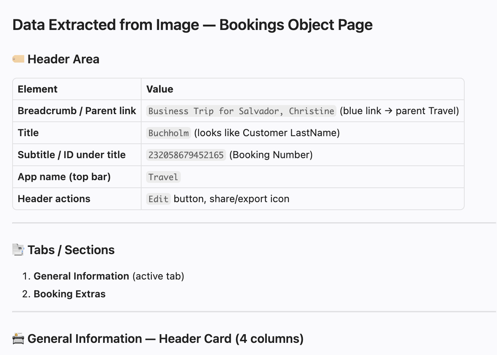
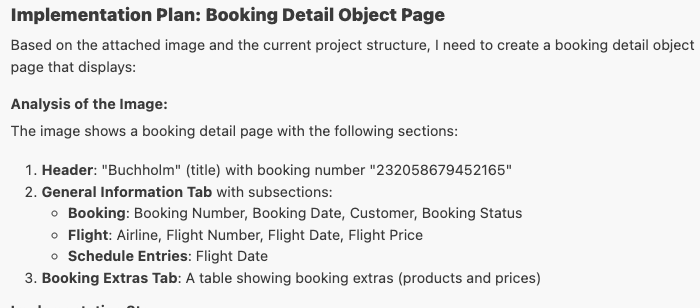

# Add Object Page for Booking Details

1. Create a new chat.

    

2. Drag and drop the image [bookings-object-page.png](../../bookings-object-page.png) from the images folder into the Copilot Chat window to attach it as context.

3. Copy and paste the following prompt into the task input and execute the task:
    ```
    Extract data from the attached Image. Do not inspect any other image files in the workspace.
    ```

4. Verify that the extracted data matches the image.

    

5. Copy and paste the following prompt into the task input and execute the task:
    ```
    Create a booking detail object page based on the extracted data.

    Create implementation plan first, then proceed with confirmation.
    Consult MCP servers.
    ```

6. Copilot prepares an implementation plan.

    

7. Confirm the implementation plan by responding with "Yes" or "Proceed".

    

8. After completion, navigate to the Travel object page and click on a row in the bookings table to open the booking object page. Verify the booking object page appears correctly in the application preview.

    

## Troubleshoot

- Booking Extras table does not appear below General Information section.
    Execute the prompt: `Change section layout to page for booking object page`.
- The booking table doesn't have navigation to object page. Execute the prompt `Ensure manifest configuration for new object page`.
- Section **Booking Extras** is missing in the booking object page. Execute the prompt: `booking extras table section is missing`.
- The Booking Extras table has no data. Execute the prompt: `add mock data for booking extras`.
- Error `Composition in draft-enabled entity can't lead to another entity with "@odata.draft.enabled" (in entity:"TravelService.Travel"/element:"Bookings")`. Copy and paste error message to Copilot to fix the issue.

## Summary

Congratulations, you have completed all exercises!
