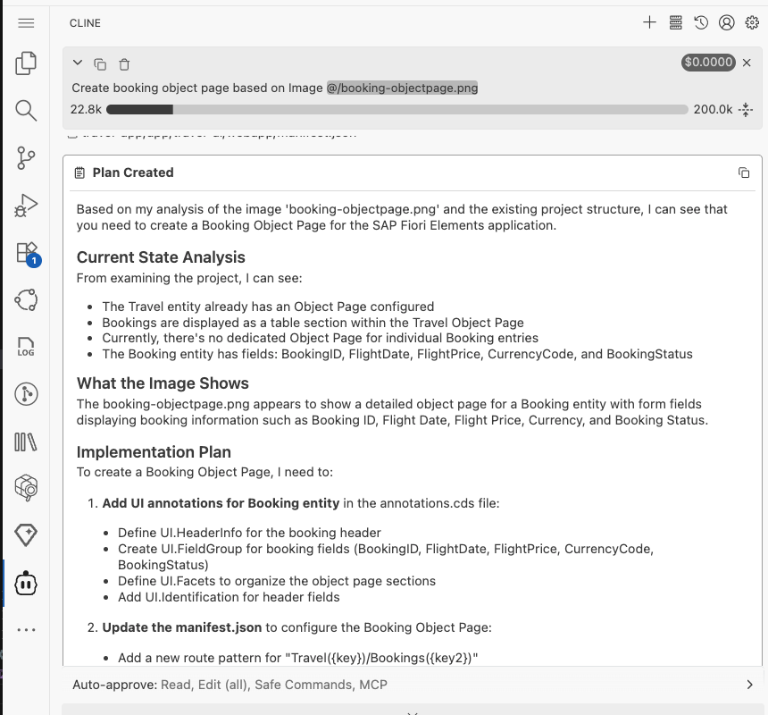
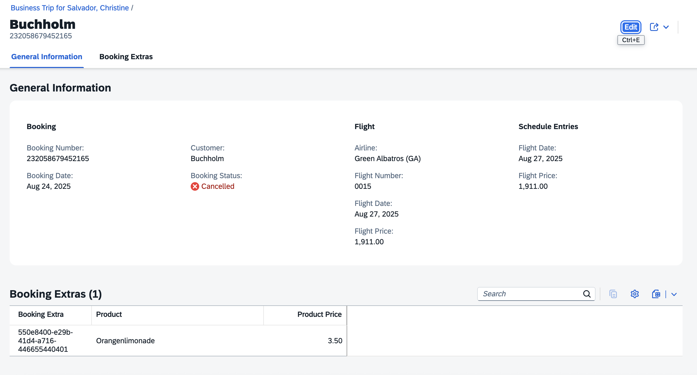

# Add Object Page for Booking Details

1. In the Cline panel, close the previous task and start a new one. Select **Plan mode**.

2. Enter the following prompt in the task input (don't execute yet):
    ```
    Create booking detail object page based on figma design from this link
    <insert_link_here>

    Use the available MCP servers.
    ```

3. In the web browser tab with your Figma Design, select **Screen 3 - Object Page**, right-click on it, and select **Copy/Paste as** → **Copy link to selection**.

4. Insert the link into the prompt text.

5. Press `Enter` to start the task.

6. Cline will generate an **Implementation Plan**.

7. Review the plan once it's ready.


> [!NOTE]
> The implementation plan generated by Cline may differ from the example shown below.



8. Switch to **Act mode**.

9. Cline will execute the implementation plan.

10. After completion, check the booking object page in the application preview.

    

## Troubleshoot

- The booking table doesn't show a navigation. Remind the LLM to add the new page to the app.
- Error `Composition in draft-enabled entity can't lead to another entity with "@odata.draft.enabled" (in entity:"TravelService.Travel"/element:"Bookings")`. Copy and paste above error message, Cline will fix issue.
- Section **Booking Extras** missing in the booking object page. Execute prompt: `booking extras table section is missing`.
- Booking Extras table has no data. Execute prompt: `add mock data for booking extras`.

## Summary

Congratulations, you have completed all exercises!
